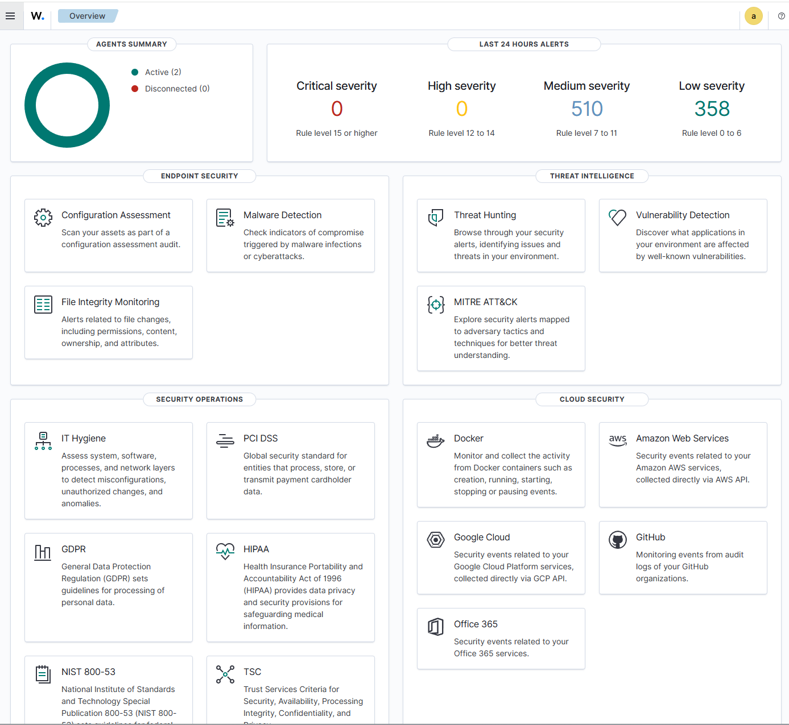
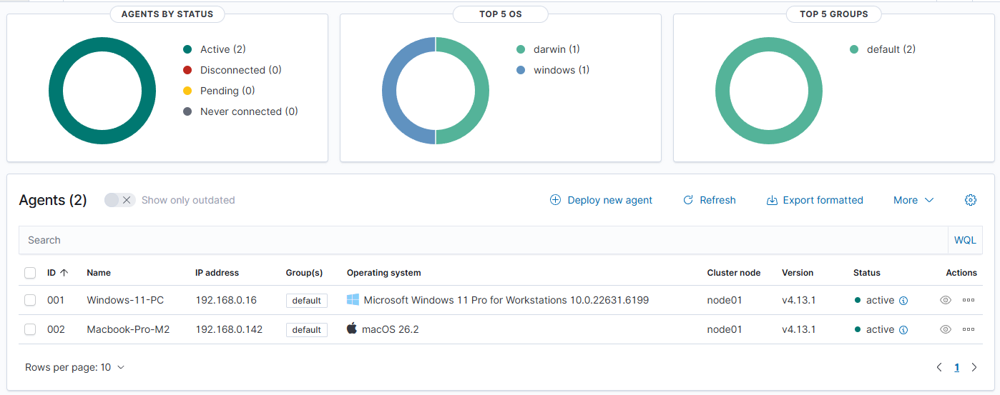
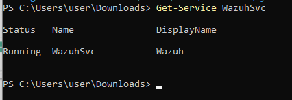
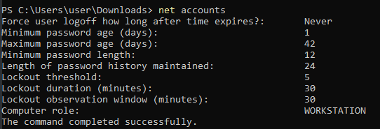
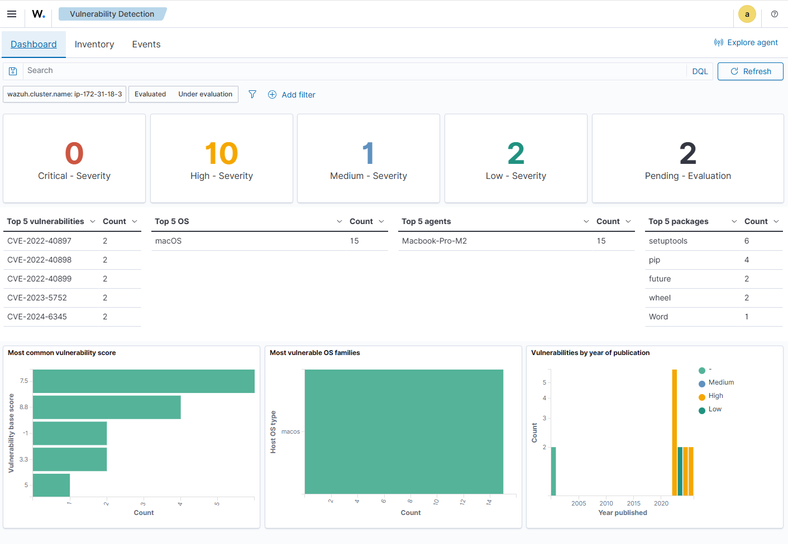

# 🏠 Wazuh SOC Homelab - Complete Security Operations Center on AWS

[](https://wazuh.com)
[](https://aws.amazon.com)
[](https://ubuntu.com)
[](https://microsoft.com)
[](https://apple.com)
[]()

> **A fully functional Security Operations Center (SOC) homelab deployed on AWS EC2 with Wazuh SIEM, monitoring Windows 11 and macOS endpoints with real-time vulnerability detection and CIS compliance monitoring.**

---

## 📋 Table of Contents
- [Project Overview](#project-overview)
- [Architecture](#architecture)
- [Infrastructure Details](#infrastructure-details)
- [What I Built](#what-i-built)
- [Step-by-Step Implementation](#step-by-step-implementation)
- [Current Status](#current-status)
- [Monitoring Capabilities](#monitoring-capabilities)
- [Security Findings](#security-findings)
- [Challenges & Solutions](#challenges--solutions)
- [Quick Commands Reference](#quick-commands-reference)
- [Lessons Learned](#lessons-learned)
- [Future Plans](#future-plans)
- [Resources](#resources)

---

## 🎯 Project Overview

This project represents a complete implementation of a Security Operations Center (SOC) homelab designed to:
- **Monitor** security events across multiple endpoints (Windows 11, macOS)
- **Detect** vulnerabilities and compliance issues
- **Analyze** security data through a centralized SIEM platform
- **Learn** SOC analyst workflows and security monitoring

### **What Makes This Special**
- ✅ **Production-like environment** on AWS EC2
- ✅ **Real-world monitoring** of personal devices
- ✅ **CIS Benchmark compliance** for Windows 11
- ✅ **Vulnerability detection** with 15+ CVEs identified
- ✅ **Advanced telemetry** with Sysmon integration

---

## 🏗️ Architecture

### **Complete Infrastructure Diagram**

```text
┌─────────────────────────────────────────────────────────────────────────┐
│                           AWS CLOUD (US East)                           │
│  ┌─────────────────────────────────────────────────────────────────┐   │
│  │                   EC2 Instance - Ubuntu 24.04                   │   │
│  │                       t3.large (8GB RAM)                        │   │
│  │                          256GB Storage                          │   │
│  │                     Elastic IP: 44.195.74.62                    │   │
│  │  ┌─────────────────────────────────────────────────────────┐   │   │
│  │  │                     WAZUH MANAGER                       │   │   │
│  │  │  ┌──────────────┐ ┌──────────────┐ ┌──────────────┐   │   │   │
│  │  │  │   Indexer    │ │    Server    │ │  Dashboard   │   │   │   │
│  │  │  │ (OpenSearch) │ │  (Manager)  │ │   (Kibana)   │   │   │   │
│  │  │  │  Port: 9200  │ │  Port: 1514  │ │  Port: 443   │   │   │   │
│  │  │  └──────────────┘ └──────────────┘ └──────────────┘   │   │   │
│  │  └─────────────────────────────────────────────────────────┘   │   │
│  └─────────────────────────────────────────────────────────────────┘   │
│                    │                   │                   │            │
│         ┌──────────┴───────────────────┴──────────────────┘            │
│         │                   │                                           │
│         ▼                   ▼                           ▼               │
│    Port 1514/1515      Port 1514/1515               Port 443           │
│         │                   │                           │               │
└─────────┼───────────────────┼───────────────────────────┼───────────────┘
          │                   │                           │
          ▼                   ▼                           ▼
┌─────────────────┐ ┌─────────────────┐ ┌─────────────────┐
│   Windows 11    │ │   MacBook Pro   │ │     Browser     │
│   Enterprise    │ │     (M2/M3)     │ │     Access      │
├─────────────────┤ ├─────────────────┤ ├─────────────────┤
│ ✅ Wazuh Agent  │ │ ✅ Wazuh Agent  │ │ ✅ Dashboard    │
│ ✅ Sysmon       │ │ ✅ Vulnerability │ │ ✅ Alerts       │
│ ✅ CIS Hardened │ │    Detection    │ │ ✅ Reports      │
│ ✅ 123 Passed   │ │ ✅ 15 CVEs      │ │ ✅ Visuals      │
└─────────────────┘ └─────────────────┘ └─────────────────┘
```

### **Network Configuration**

| Component | Configuration |
|-----------|--------------|
| **VPC** | Default VPC |
| **Subnet** | Public subnet with auto-assign IP |
| **Security Group** | Custom rules for monitoring |
| **Internet Gateway** | Configured for public access |

### **Security Group Rules**

| Direction | Port | Protocol | Source | Purpose |
|-----------|------|----------|--------|---------|
| **Inbound** | 22 | TCP | 0.0.0.0/0 | SSH Access |
| **Inbound** | 443 | TCP | 0.0.0.0/0 | Wazuh Dashboard (HTTPS) |
| **Inbound** | 1514 | TCP | 0.0.0.0/0 | Agent Communication |
| **Inbound** | 1515 | TCP | 0.0.0.0/0 | Agent Enrollment |
| **Outbound** | All | All | 0.0.0.0/0 | Internet Access |

---

## 💻 Infrastructure Details

### **AWS EC2 Configuration**

```yaml
Instance Type: t3.large
vCPUs: 2
RAM: 8 GB
Storage: 256 GB
OS: Ubuntu 24.04 LTS
Region: US East (N. Virginia)
Public IP: 44.195.74.62 (Elastic IP - static)
Availability Zone: us-east-1
```

### **Wazuh Components**

| Component | Version | Purpose |
|-----------|---------|---------|
| Wazuh Manager | 4.13.1 | Central security monitoring |
| Wazuh Indexer | 4.13.1 | Data storage (OpenSearch) |
| Wazuh Dashboard | 4.13.1 | Visualization (Kibana) |
| Filebeat | Latest | Log shipping |

### **Endpoints Monitored**

| Device | OS | Status | Key Features |
|--------|----|--------|--------------|
| Windows 11 PC | Windows 11 Enterprise | ✅ Active | Wazuh Agent + Sysmon + CIS Hardened |
| MacBook Pro | macOS Sonoma (M2) | ✅ Active | Wazuh Agent + Vulnerability Detection |

---

## 🛠️ What I Built

### 1. AWS Infrastructure
- ✅ Launched EC2 t3.large instance (upgraded from t2.micro due to RAM requirements)
- ✅ Configured Elastic IP for static public access
- ✅ Set up security groups with proper inbound/outbound rules
- ✅ Ensured outbound internet access for updates

### 2. Wazuh SIEM Platform
- ✅ Installed Wazuh all-in-one (Manager + Indexer + Dashboard)
- ✅ Configured vulnerability detection with 12-hour scans
- ✅ Created custom Sysmon detection rules
- ✅ Enabled CIS benchmarking for Windows

<p align="center">
	
</p>

### 3. Windows 11 Agent
- ✅ Deployed Wazuh agent with automatic enrollment
- ✅ Installed Sysmon for advanced telemetry
- ✅ Applied CIS security benchmarks (123 controls passed)
- ✅ Configured account lockout policies
- ✅ Set password complexity requirements (min 12 chars, history 24)

<p align="center">
    
</p>

### 4. macOS Agent
- ✅ Deployed Wazuh agent for Apple Silicon (M2)
- ✅ Configured automatic enrollment
- ✅ Enabled vulnerability scanning
- ✅ Detected 15+ CVEs across Python packages

### 5. Security Hardening
- ✅ CIS Windows 11 Enterprise Benchmark: 123 passed controls
- ✅ Password policies enforced
- ✅ Account lockout after 5 failed attempts
- ✅ Sysmon process monitoring active
- ✅ Network connection tracking enabled

<p align="center">
	
</p>
---

## 📝 Step-by-Step Implementation

### Phase 1: AWS Infrastructure Setup

#### 1.1 Launch EC2 Instance
```bash
# Selected t3.large (8GB RAM) - t2.micro failed due to insufficient memory
# OS: Ubuntu 24.04 LTS
# Storage: 256 GB
# Security group with required ports
```

#### 1.2 Configure Security Groups
```bash
# Inbound rules added for:
- SSH (22) - Remote management
- HTTPS (443) - Wazuh dashboard
- Custom TCP (1514) - Agent communication
- Custom TCP (1515) - Agent enrollment

# Outbound rule added:
- All traffic to 0.0.0.0/0 (required for updates)
```

#### 1.3 Assign Elastic IP
```bash
# Allocated Elastic IP to prevent IP changes on reboot
# Associated with instance for static public access
# Final IP: 44.195.74.62
```

### Phase 2: Wazuh Installation

#### 2.1 Install Wazuh All-in-One
```bash
# Download installer
curl -sO https://packages.wazuh.com/4.13/wazuh-install.sh

# Run installation (took ~10 minutes)
sudo bash ./wazuh-install.sh -a -i

# Installation completed successfully
# Services running:
# - wazuh-indexer (OpenSearch)
# - wazuh-manager
# - wazuh-dashboard
```

#### 2.2 Verify Services
```bash
# All services active and running
sudo systemctl status wazuh-manager    # active
sudo systemctl status wazuh-indexer    # active (1.4GB memory)
sudo systemctl status wazuh-dashboard  # active
```

#### 2.3 Configure Vulnerability Detection
```bash
# Enabled in /var/ossec/etc/ossec.conf
<vulnerability-detector>
  <enabled>yes</enabled>
  <interval>12h</interval>
  <run_on_start>yes</run_on_start>
</vulnerability-detector>
```

### Phase 3: Windows 11 Agent Deployment

#### 3.1 Install Wazuh Agent
```powershell
# Download and install with configuration
.\wazuh-agent-4.13.1-1.msi /q WAZUH_MANAGER="44.195.74.62" WAZUH_REGISTRATION_SERVER="44.195.74.62" WAZUH_AGENT_NAME="Windows-11-PC"

# Verify service
Get-Service WazuhSvc  # Status: Running
```

#### 3.2 Install Sysmon
```powershell
# Download Sysmon and configuration
Invoke-WebRequest -Uri "https://live.sysinternals.com/sysmon64.exe" -OutFile "sysmon64.exe"
Invoke-WebRequest -Uri "https://raw.githubusercontent.com/olafhartong/sysmon-modular/master/sysmonconfig.xml" -OutFile "sysmonconfig.xml"

# Install
.\sysmon64.exe -accepteula -i sysmonconfig.xml

# Verify
Get-Service Sysmon64  # Status: Running
```

#### 3.3 Apply CIS Security Controls
```powershell
# Password policy enforcement
net accounts /uniquepw:24      # Remember 24 passwords
net accounts /minpwage:1        # Minimum 1 day password age
net accounts /minpwlen:12       # Minimum 12 characters
net accounts /lockoutthreshold:5  # Lock after 5 failed attempts
net accounts /lockoutduration:30  # Lock for 30 minutes
net accounts /lockoutwindow:30    # Reset counter after 30 minutes

# Verified settings
net accounts
```

### Phase 4: macOS Agent Deployment

#### 4.1 Install Wazuh Agent (Apple Silicon)
```bash
# Download for M2/M3
curl -O https://packages.wazuh.com/4.x/macos/wazuh-agent-4.13.1-1.arm64.pkg

# Install with configuration
sudo env WAZUH_MANAGER="44.195.74.62" WAZUH_REGISTRATION_SERVER="44.195.74.62" WAZUH_AGENT_NAME="MacBook-Pro" installer -pkg wazuh-agent-4.13.1-1.arm64.pkg -target /

# Start agent
sudo launchctl bootstrap system /Library/LaunchDaemons/com.wazuh.agent.plist

# Verify status
/Library/Ossec/bin/ossec-control status  # All processes running
```

### Phase 5: Custom Rules & Configuration

#### 5.1 Create Sysmon Detection Rules
```xml
<!-- /var/ossec/etc/rules/local_rules.xml -->
<group name="sysmon">
  <rule id="100100" level="5">
    <decoded_as>json</decoded_as>
    <field name="win.system.eventID">^1$</field>
    <description>Sysmon: Process creation</description>
  </rule>

  <rule id="100101" level="7">
    <decoded_as>json</decoded_as>
    <field name="win.system.eventID">^3$</field>
    <description>Sysmon: Network connection</description>
  </rule>
</group>
```

---

## ✅ Current Status

### System Health

| Component | Status | Details |
|-----------|--------|---------|
| Wazuh Manager | 🟢 Active | Processing events in real-time |
| Wazuh Indexer | 🟢 Active | 1.4GB memory, storing data |
| Wazuh Dashboard | 🟢 Active | Accessible via HTTPS |
| Windows Agent | 🟢 Active | Sending Sysmon + Wazuh events |
| macOS Agent | 🟢 Active | Sending system logs + vulnerabilities |

### Connected Agents

```text
ID: 000 | Name: ip-172-31-18-3 (server) | IP: 127.0.0.1 | Status: Active/Local
ID: 001 | Name: Windows-11-PC | IP: any | Status: Active
ID: 002 | Name: MacBook-Pro | IP: any | Status: Active
```

### Security Compliance - Windows 11

```text
CIS Microsoft Windows 11 Enterprise Benchmark:
├── Passed: 123 controls ✅
├── Failed: 353 controls ⚠️ (being addressed)
└── Not applicable: 5 controls ℹ️

Key Controls Applied:
├── 26000: Enforce password history (24) ✅
├── 26001: Maximum password age ✅
├── 26002: Minimum password age (1 day) ✅
├── 26003: Minimum password length (12) ✅
├── 26005-07: Account lockout policies ✅
└── 26009: Guest account status ✅

<p align="center">
	
</p>
```

### Vulnerability Detection - macOS

```text
Total Vulnerabilities Found: 15

Top CVEs:
├── CVE-2022-40897 (x2)
├── CVE-2022-40898 (x2)
├── CVE-2022-40899 (x2)
├── CVE-2023-5752 (x2)
└── CVE-2024-6345 (x2)

Vulnerable Packages:
├── setuptools (6 instances)
├── pip (4 instances)
├── future (2 instances)
├── wheel (2 instances)
└── Word (1 instance)

Severity Distribution:
├── Critical: 0
├── High: 10
├── Medium: 1
├── Low: 2
└── Pending: 2


<p align="center">
	
</p>
```

---

## 📊 Monitoring Capabilities

### What I Can Monitor Now

#### Windows 11
- ✅ Process creation and termination
- ✅ Network connections (source/destination IP)
- ✅ Registry modifications
- ✅ File system changes
- ✅ Authentication events
- ✅ PowerShell command execution
- ✅ Service installations
- ✅ Scheduled tasks

#### macOS
- ✅ System logs
- ✅ Vulnerability scanning
- ✅ Package management
- ✅ Process monitoring
- ✅ Network connections
- ✅ File integrity
- ✅ User authentication

#### Security Events
- ✅ Suspicious process execution
- ✅ Unauthorized network connections
- ✅ Policy violations
- ✅ Failed login attempts
- ✅ Account lockouts
- ✅ Privilege escalations

---

## 🔍 Security Findings

### Critical Findings & Remediation

| Finding | Severity | Status | Remediation |
|---------|----------|--------|-------------|
| Weak password policy | 🔴 High | ✅ Fixed | Set min 12 chars, history 24 |
| No account lockout | 🔴 High | ✅ Fixed | Lock after 5 attempts |
| Weak password age | 🟡 Medium | ✅ Fixed | Min 1 day, max 42 days |
| Python packages vulnerable | 🟡 Medium | 🔄 In Progress | Updating pip, setuptools |
| Missing Sysmon telemetry | 🟡 Medium | ✅ Fixed | Sysmon installed & configured |
| No vulnerability scanning | 🟢 Low | ✅ Fixed | Wazuh vulnerability detector enabled |

---

## 🚧 Challenges & Solutions

### Challenge 1: Insufficient RAM on t2.micro

Problem: Wazuh indexer failed to start on t2.micro (1GB RAM)

```text
ERROR: wazuh-indexer could not be started
```

Solution: Upgraded to t3.large (8GB RAM)

```bash
# Stopped instance, changed type to t3.large
# Wazuh indexer now runs with 1.4GB memory allocation
```

### Challenge 2: Outbound Rules Missing

Problem: EC2 couldn't access internet for updates

```text
Cannot initiate connection - Network is unreachable
```

Solution: Added outbound rule allowing all traffic to 0.0.0.0/0

### Challenge 3: Syntax Error in Custom Rules

Problem: Wazuh manager failed to start

```text
ERROR: Syntax error on tag 'win.eventdata.image' in rule 100103
```

Solution: Simplified rules and removed complex regex patterns

### Challenge 4: Agent Not Connecting

Problem: Windows agent couldn't resolve hostname

```text
ERROR: Could not resolve hostname: [noul-ip]
```

Solution: Manually edited ossec.conf with correct IP address

### Challenge 5: API Connection Issues

Problem: Dashboard showing "API is down"

```text
[API connection] API is down
```

Solution: Restarted services in correct order (indexer → manager → dashboard)

---

## ⌨️ Quick Commands Reference

### EC2 Management
```bash
# Connect via SSH
ssh -i your-key.pem ubuntu@44.195.74.62

# Check all services
sudo systemctl status wazuh-manager wazuh-indexer wazuh-dashboard

# Restart all services
sudo systemctl restart wazuh-indexer wazuh-manager wazuh-dashboard

# View agent list
sudo /var/ossec/bin/agent_control -lc

# Monitor logs
sudo tail -f /var/ossec/logs/ossec.log
```

### Windows Agent Management
```powershell
# Check agent status
Get-Service WazuhSvc

# Restart agent
Restart-Service WazuhSvc

# View agent logs
Get-Content "C:\Program Files (x86)\ossec-agent\ossec.log" -Tail 50

# Check Sysmon
Get-Service Sysmon64

# View Sysmon events
Get-WinEvent -LogName "Microsoft-Windows-Sysmon/Operational" -MaxEvents 20
```

### macOS Agent Management
```bash
# Check status
/Library/Ossec/bin/ossec-control status

# Restart agent
sudo launchctl bootout system /Library/LaunchDaemons/com.wazuh.agent.plist
sudo launchctl bootstrap system /Library/LaunchDaemons/com.wazuh.agent.plist

# View logs
sudo tail -50 /Library/Ossec/logs/ossec.log
```

---

## 📚 Lessons Learned

### Technical Takeaways
- Right-sizing matters: t2.micro is insufficient for Wazuh; t3.large (8GB) is the sweet spot
- Network configuration: Outbound rules are crucial - EC2 needs internet access for updates
- Service order: Always start indexer first, then manager, then dashboard
- Elastic IP: Essential for consistent access when instance restarts
- Custom rules: Test syntax with wazuh-logtest before applying

### Security Insights
- CIS benchmarks provide excellent security baseline
- Sysmon dramatically improves visibility on Windows
- Vulnerability scanning reveals surprising issues (outdated Python packages)
- Real-time monitoring catches issues immediately

### Operational Lessons
- Document everything - saved time during troubleshooting
- Monitor logs - most issues visible in logs
- Test connectivity before assuming configuration works
- Backup configs before making changes

---

## 🚀 Future Plans

### Short-term (Next Month)
- TheHive - Implement incident response platform
- CrowdSec - Add collaborative threat intelligence
- Email alerts - Configure notification system
- Remediate macOS CVEs - Update vulnerable packages

### Medium-term (3 months)
- Suricata - Deploy network intrusion detection
- MISP - Set up threat intelligence platform
- Automated playbooks - Create response automation
- Additional agents - Add Linux endpoints

### Long-term (6 months)
- Shuffle SOAR - Implement security orchestration
- Velociraptor - Add digital forensics capability
- Custom dashboards - Build specific monitoring views
- Compliance reporting - Automated report generation

---

## 📖 Resources

### Official Documentation
- Wazuh Documentation
- CIS Benchmarks
- Sysmon Modular
- AWS EC2 Documentation

### Learning Resources
- Wazuh Training
- SOC Analyst Skills
- OpenSearch Documentation

### Community
- Wazuh GitHub
- Reddit r/Wazuh
- Discord: Wazuh Community

---

## 📝 Notes

### Environment Details
- Installation Date: March 24, 2026
- Wazuh Version: 4.13.1
- Ubuntu Version: 24.04 LTS
- AWS Region: us-east-1
- Elastic IP: 44.195.74.62 (static)

---

## ⚠️ Disclaimer

This homelab is designed for educational purposes to learn security monitoring and SOC operations. All monitoring is performed on personal devices with proper authorization. Always ensure compliance with local regulations and obtain proper consent before monitoring any systems.

---

## 👨‍💻 Author

SOC Homelab Builder

Built as a learning project to understand Security Operations Centers
Hands-on experience with SIEM, vulnerability management, and compliance monitoring
Continuous improvement and expansion planned
